## Milestone 3 – Easy Dinners Website

I am designing a recipe sharing database website. The website will contain recipes for quick, easy family dinners.

[Link to deployed site](https://ms3-easydinner.herokuapp.com/)

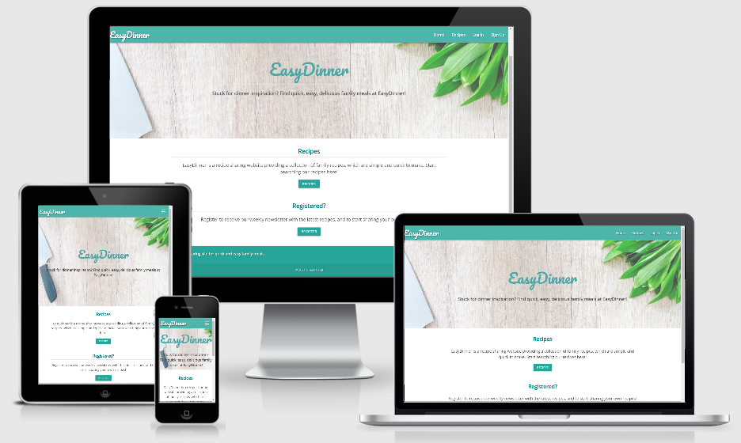

## UX

_Overview_

The aim of the project is to design a recipe website containing a database of quick, easy family meals. 
The website is designed to cater to those specifically looking for recipes which fit this criteria, for example busy parents who don't have time or energy to think about dinner, or prepare complicated meals for their family! 
As this website will contain an active database, there will be an option for users to signup to add their own recipes.
The website is designed to be suitable for use on all devices, from desktop to mobile. 

_User Stories_
	
   *	I want the website to be intuitive, so I can get an impression of what it does from first glance.
   *	I want the website to be visually appealing and well presented.
   *	I want the recipe listing feature to be searchable, so I can search for specific recipes I may be interested in.
   *	I want an easy way to login or signup to the website.
   *	I want it to be easy to add/edit a recipe.
	
_5 S's_

**Strategy** 

The primary goal is to provide a searchable database of recipes for website users, which is visually appealing, and easy to use.

**Scope** 

The overall look and feel of the website was influenced by researching similar websites (credits at end):
-	These are simple/clean in design.
-	Recipes are displayed in a grid of "cards" consisting of an image and recipe title, clicking on a recipe card takes you to the recipe details page.
-	There is a facility to search recipes. 
-	There is a facility to login/register to the site, which then takes you to your profile page.

With this in mind, my website will include:
- 	A homepage with some details about the website, some featured recipes, and links to sign in or register (inlcuded to give an overview of the site, and make it intuitive for the user).
-	A searchable recipes page, which will display the recipes in a "card" or grid format.
-	Clicking on the recipe "card" will bring up that particular recipe details page, including the ingredients/method.
-	A login/sign up page.
-	Once logged in the user will be directed to their user profile page, which will give the user options to add/edit their own recipe.

**Structure** 

In line with the features identified in the scope section, the website will be structured as follows:

1.	Homepage:

	-	Navbar at top, showing website title/logo, and links to other pages (fixed/featured on all pages for familiarity/ease of use).
	-	Hero image with text explaining the purpose of the site.
 	- 	Some featured recipes.
	- 	Links to log in or sign in.
	-	Footer showing social media links (fixed/featured on all pages for familiarity/ease of use).
	- 	This page has been included/designed in this way to give the user an effective snapshot of the site, you can see all the main features of the site from looking at this page:
		-	Introductory text and hero image "explain" the sites purpose.
		-	The featured recipes give a preview of the type of recipes they can access.
		-	The sign in/log in links show that this is a interactive/sharing site, the accompanying text will encourage the user to do so.
  
2.	Recipes:

	-	A search feature at the top of the page. 
	-	Recipes displayed via "cards" or thumbnails, consisting of the recipe image/recipe title, in a grid format.

3.	Recipe Details:
	
	-	Will include all recipe details including ingredients, method, added by, prep time, servings.

4. 	Login/Sign Up:
	-	The log in and sign up pages will be the same, requiring the user to input username/password.

5. 	Profile:
	-	Will include the facility to add users own recipes, as well as edit any recipes already submitted.


**Skeleton** 

[Wireframes](https://github.com/upeshp/MS3_EasyDinner/tree/master/assets/docs/wireframe)


**Surface** 

-	The colour scheme will be influenced from the research detailed in the scope section above.
-	The websites tend to use simple colour schemes, with green/teal often being used.
-	Green is associated with being peaceful and healthy, which is perfect for this site, so this colour will be used in my site for any main features [Source: CrazyEgg](https://www.crazyegg.com/blog/website-color-palettes/).
-	A clear, easy to read, friendly style of font was wanted, I decided on a combination of Open Sans/Roboto (Google Fonts) as I thought this matches these particular requirements.

## Features

_Existing_

The website uses Materialize CSS features:

-   Navbar (top navbar)
-	Sidenav (to turn into sidenav on mobile)
- 	Cards (to display recipes)
-   Forms (to add/edit recipes)
- 	Buttons (for links to other pages and add/edit/delete actions)
- 	Footer (bottom footer)
-   Tooltip (to display message on delete button)
-   Chips (to display some recipe info)

In addition the following features are used:

-   Site linked to MongoDB database
-   Search facility to search recipes
-   Login/signup functionality to become a registered user
-   User profile page displaying users recipes only
-   Passwords are hashed so not shown on the database
-   Full CRUD functionality included
-   Custon 404/500 error pages

_Left to Implement_

The following features were considered during the build of the site, however due to time constraints, these were not included in this version, but could be added at a later date:

- 	Ability to rate/mark a recipe as a favourite
-	Introducing recipe categories e.g. vegetarian/quick/easy etc which can then be filtered
-	Pagination to ensure not too many recipes displayed on 1 page
-   Displaying latest or featured recipes on homepage
-   See unresolved bugs section in Testing for further features left to implement

## Technologies Used

Languages:
- 	HTML5
-	CSS3
-	Javascript
-	Python (incl. Jinja)

Database:
-   MongoDB

Frameworks:
-   Materialize CSS
-   Flask
-   Jquery

Storing/editing/deploying Code:
-	Gitpod
-	Github
-   Heroku

Other:
-   Google Fonts
-   Font Awesome

## Testing

Testing documentation can be found [here](https://github.com/upeshp/MS3_EasyDinner/blob/master/TESTING.md)

## Deployment

_Deployment to Heroku_

1.  Setup files which Heroku needs in your terminal:

    requirements.txt: tells Heroku which applications and dependencies are required to run our app
    
    Procfile: what Heroku looks for to know which file runs the app (use capital P for Procfile, and delete blank line at bottom of Procfile as may cause problems when running on Heroku)
    
    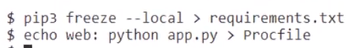

2.  Go to Heroku, once logged into your dashboard, click ‘Create new app’:

    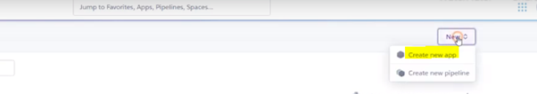
    
    Create app name (must be unique, and generally use a 'dash' or 'minus' instead of spaces, and all lowercase letters)
    
    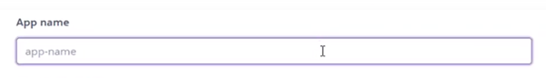
    
    Choose region closest to you
    
    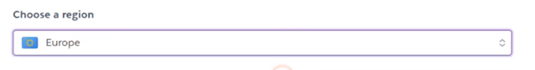
    
    Then click ‘Create app’
    
    

3.	Setup automatic deployment from your GitHib repository:

    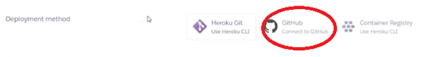
    
    Make sure your GitHub profile is displayed
    
    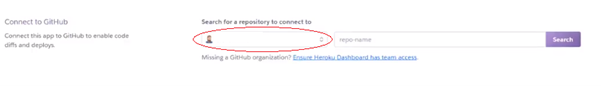
    
    Then add your repository name
    
    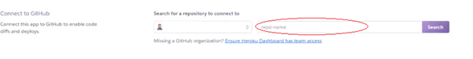
    
    Click ‘Search’
    
    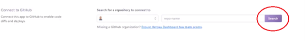
    
    Once it finds your repo, click to connect to this app
    
    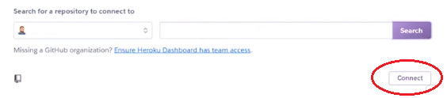

4.	Click on ‘Settings’:
    
    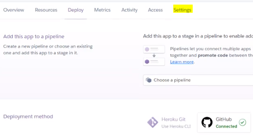
    
    Then click ‘Reveal Config Vars’
    
    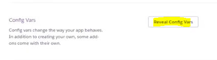
    
    Then enter the variables (from the env.py) file to securely tell Heroku which variables are required:
    IP
    PORT
    MONGO_DBNAME
    MONGO_URI
    SECRET_KEY

5.	Push two new files (requirements.txt and Profile) to repository, in terminal, add/commit/push these:
    
    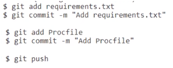

6.	Back in Heroku, can now safely ‘Enable Automatic Deployment’:
    
    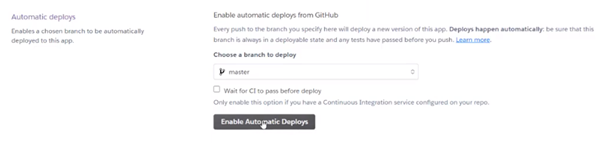

    Then ‘Deploy Branch’
    
    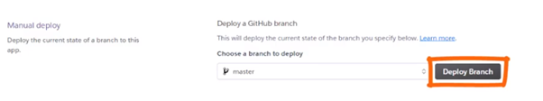

7.	That should take a minute to build, once it's done, you'll see ‘Your app was successfully deployed.’ Click ‘View’ to launch your new app.
    
    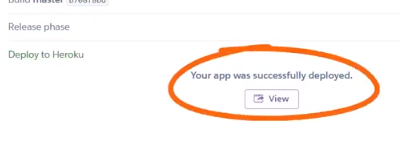

_GitHub_

To clone the code from GitHub:

1.	On GitHub, navigate to the main page of the repository.
2.	Above the list of files, click Code.

    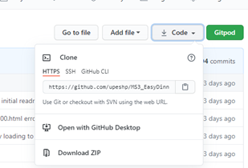

3.	To clone the repository using HTTPS, click HTTPS under "Clone".
4.	Open Git Bash.
5.	Change the current working directory to the location where you want the cloned directory.
6.	Type git clone, and then paste the URL you copied earlier:
    ```$ git clone https://github.com/YOUR-USERNAME/MS3_EasyDinner.git```
7.	Press Enter to create your local clone.
8.  Create your own env.py file to store variables:

     - Import os 
     - os.environ.setdefault("IP", "enter value") 
     - os.environ.setdefault("PORT", "enter value") 
     - os.environ.setdefault("SECRET_KEY", "enter value") 
     - os.environ.setdefault("MONGO_URI", "enter value") 
     - os.environ.setdefault("MONGO_DBNAME", "enter value")

## Credits

_Tutorials_

I used the Code Institute Task Manger Mini-Project by [Tim Nelson](https://code-institute-room.slack.com/team/UBVE86CJC) as the main basis of my own project.

_Slack Community_

I was able to resolve many issues encountered after searching on Slack in the Code Institute community, the following in paticular have posted useful content:

 - [Ed Bradley](https://code-institute-room.slack.com/team/U0112RF2N79)
 - [Igor Basuga](https://code-institute-room.slack.com/team/UPDFEU62U)
 - [Daniel Hayes](https://code-institute-room.slack.com/team/UCQ2AF9JT)
 - [Malia Havlicek](https://code-institute-room.slack.com/team/UERRFE54G)
 - [Heather Olcot](https://code-institute-room.slack.com/team/U9CBT421G)
 - [Antonio Augello](https://code-institute-room.slack.com/team/UCS5Q5LKH)

_Images_

Hero image on homepage from [Pixabay](https://pixabay.com/)

_Research_

I used the following websites as a reference in the design process:

 - [Hello Fresh](https://www.hellofresh.co.uk/recipes/quick-recipes)
 - [Delicious Magazine](https://www.deliciousmagazine.co.uk/collections/healthy-family-meals/)